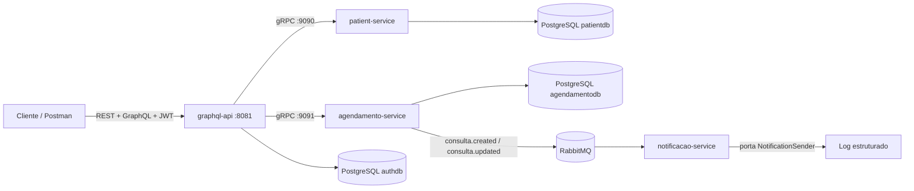
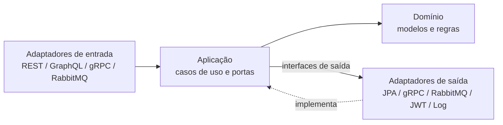
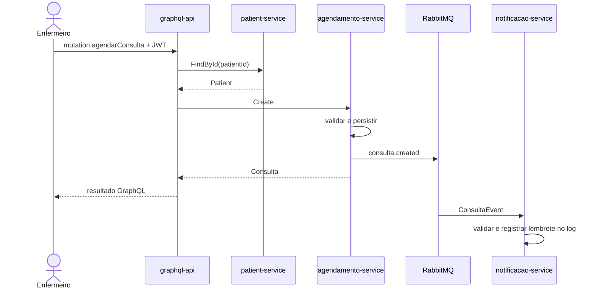

# CareSync

[](https://openjdk.org/)
[](https://spring.io/projects/spring-boot)
[](https://graphql.org/)
[](https://grpc.io/)
[](https://www.postgresql.org/)
[](https://www.rabbitmq.com/)
[](https://docs.docker.com/compose/)
[](https://www.jacoco.org/jacoco/)

Backend hospitalar modular para autenticação por perfil, consulta de pacientes e históricos, agendamento de consultas e notificações assíncronas. A entrada pública combina REST para autenticação/administração e GraphQL para pacientes e consultas; a comunicação interna usa gRPC e RabbitMQ.

## Arquitetura



Cada serviço segue arquitetura hexagonal:



| Serviço | Responsabilidade | Entrada | Saídas | Persistência |
|---|---|---|---|---|
| `graphql-api` | Gateway, JWT, autorização e usuários | REST/GraphQL `:8081` | gRPC, JWT, BCrypt | PostgreSQL `authdb` |
| `patient-service` | Consulta de pacientes | gRPC `:9090` | JPA | PostgreSQL `patientdb` |
| `agendamento-service` | Criar, editar e listar consultas | gRPC `:9091` | JPA e RabbitMQ | PostgreSQL `agendamentodb` |
| `notificacao-service` | Consumir eventos e enviar lembrete simulado | RabbitMQ | Log estruturado | Stateless |

### Fluxo de agendamento



## Segurança e contratos

`POST /auth/login` recebe `{"username":"...","password":"..."}` e devolve `{"token":"..."}`. Use `Authorization: Bearer <token>` nas demais chamadas.

| Operação | ADMIN | MÉDICO | ENFERMEIRO | PACIENTE |
|---|:---:|:---:|:---:|:---:|
| Gerenciar `/users` | ✅ | ❌ | ❌ | ❌ |
| Consultar paciente/histórico | ❌ | ✅ qualquer | ✅ qualquer | ✅ próprio |
| `agendarConsulta` | ❌ | ❌ | ✅ | ❌ |
| `editarConsulta` | ❌ | ✅ | ❌ | ❌ |

GraphQL (`POST /graphql`, GraphiQL em `/graphiql`):

- `patient(id)`
- `consultasDoPaciente(patientId)`
- `consultasFuturasDoPaciente(patientId)`
- `agendarConsulta(input)`
- `editarConsulta(input)`

REST administrativo (`ADMIN`): `POST /users` retorna `201`, `GET /users` retorna `200` e `DELETE /users/{id}` retorna `204`. Swagger UI: `http://localhost:8081/swagger-ui/index.html`.

Eventos AMQP usam o exchange `consulta.exchange`, routing keys `consulta.created` e `consulta.updated`, fila `notificacao.queue` e dead-letter queue `notificacao.dlq`. O adaptador atual simula o envio do lembrete por log estruturado.

## Executar

Pré-requisitos: Docker com Compose. A opção local também exige Java 17+ e RabbitMQ/PostgreSQL nas portas indicadas.

```bash
docker compose up --build
```

Serviços expostos:

- GraphQL/API: `http://localhost:8081`
- gRPC pacientes: `localhost:9090`
- gRPC agendamentos: `localhost:9091`
- RabbitMQ Management: `http://localhost:15672` (`guest` / `guest`)
- PostgreSQL: pacientes `5432`, agendamentos `5433`, autenticação `5434`

Os schemas são versionados com Flyway. A massa é idempotente e inclui:

| Usuário | Senha | Perfil/vínculo |
|---|---|---|
| `admin1` | `senha123` | ADMIN |
| `medico1` | `senha123` | MEDICO |
| `enfermeiro1` | `senha123` | ENFERMEIRO |
| `paciente1` | `senha123` | PACIENTE / paciente 1 |
| `paciente2` | `senha123` | PACIENTE / paciente 2 |

Também existem dois pacientes, uma consulta passada e duas futuras. Essas credenciais são exclusivamente acadêmicas; configure `JWT_SECRET` e senhas próprias fora do ambiente local.

Para execução sem Docker, inicie os três PostgreSQL e o RabbitMQ, configure as variáveis descritas em `application.properties` e execute cada serviço em um terminal:

```bash
./mvnw spring-boot:run
```

## Testar

Cada módulo possui gate JaCoCo mínimo de 95% para linhas e branches. Apenas classes geradas pelo Protobuf são excluídas.

```bash
cd patient-service && ./mvnw clean verify
cd agendamento-service && ./mvnw clean verify
cd notificacao-service && ./mvnw clean verify
cd graphql-api && ./mvnw clean verify
```

Relatórios: `<serviço>/target/site/jacoco/index.html`.

Teste funcional completo:

```bash
npx newman run CareSync.postman_collection.json
```

A collection autentica todos os perfis, cria e remove usuário, valida isolamento de paciente, consulta histórico e futuras, agenda e edita uma consulta usando IDs/datas dinâmicos e cobre autenticação, autorização e entradas inválidas.

Para reiniciar também os dados locais:

```bash
docker compose down -v
docker compose up --build
```

## Decisões e limites

- Cada serviço persistente é dono de seu banco; não há joins entre microsserviços.
- O `notificacao-service` permanece stateless e a entrega externa é uma porta substituível; e-mail/SMS não fazem parte desta versão.
- Datas usam ISO-8601 local, por exemplo `2026-10-01T14:30:00`; novas consultas precisam estar no futuro.
- Status aceitos: `SCHEDULED`, `COMPLETED` e `CANCELLED`.
- Falhas permanentes no consumo RabbitMQ seguem para `notificacao.dlq` após três tentativas.

A documentação técnica completa está em `output/pdf/caresync-documentacao.pdf`.
